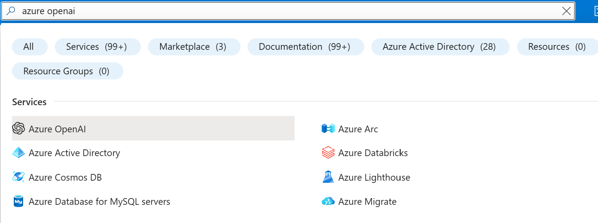

# OpenAI in Power Virtual Agent

- [OpenAI in Power Virtual Agent](#openai-in-power-virtual-agent)
    - [Summary](#summary)
    - [Step by Step Guide](#step-by-step-guide)
  - [Provisioning Azure Open AI Services](#provisioning-azure-open-ai-services)
  - [( Option 1 ) Import Preconfigured PVA with Context](#-option-1--import-preconfigured-pva-with-context)
  - [( Option 2 ) Manually Setup PVA and Flow with Context](#-option-2--manually-setup-pva-and-flow-with-context)

### Summary

Integrate Azure OpenAI Services with PVA with maintaing Context as a Global Varaible in PVA.

### Step by Step Guide

## Provisioning Azure Open AI Services

1. Head to [https://portal.azure.com](https://portal.azure.com)

2. Once you login, at the top search bar search for "**Azure OpenAI**"
   </br>
   
    </br>
3. Click on + Create and go through the creation process
   </br>
   
    </br>
4. Once the provisioning is done click on "**Go to Azure OpenAI Studio**"
    </br>
    
    </br>
5. On the left pane click on Deployments and + Create a new deployment , choose the gpt-35-turbo model and create.
   </br>
     
    </br>
6. Once the deployment is done , click on it and click on "**Open in Playground**"
   </br>
    
    </br>
7. Under Chat session click on "**View Code**" and take note of **Endpoint** and **Key**
   </br>
    
    </br>
    </br>
## ( Option 1 ) Import Preconfigured PVA with Context

1. Download "**OpenAIPVA.zip**" from the repo 

2. Head to [https://make.powerapps.com/](https://make.powerapps.com/)

3. Once you login , On the left pane click on Solution , then on the top "**Import Solution**"

4. Browse and choose the .zip file you just downloaded , Click Next and then Import. *( might take some time )*

5. Once the Import is successful you will see a notification on top of the page

6. Click on the imported solution, you will see 1 chatbot , 1 cloud flow and 2 Enviroment variables imported.
   </br>
    
    </br>
7. On the left pane click on **Enviroment Variable**
   </br>
    

8. Click on API-Key and set the Default value to the Key we Aquired from the Azure OpenAI Service in the previous step
   </br>
    

9. Do the same with **OpenAPI-GPT35_URL** and set the default value to the **Endpoint URL**.

10. One left pane click on **Chatbots** and open **GV-OpenAI** its going to redirect you to the PVA page and thats it !

</br>
</br>

## ( Option 2 ) Manually Setup PVA and Flow with Context

1. Head to [https://web.powerva.microsoft.com/](https://web.powerva.microsoft.com/)

2. On the left pane click on **Chatbots** and **+ New chatbot**

3. Give the bot a name and click **create**

4. Once created Click on it and on the left pane click on **Topics**
   </br>
    

5. In this PVA example we are going to use only 2 topics , "**Conversation Start**" and "**Fallback**"

6. I turned off all topics under **Custom** and **System** tab execpt the above 2
   </br>
    
    </br>
7. Click on the **Conversation Start** under **System** tab

8. Under the **Message** node click **+** , and select "**Variable managment**" then "**Set a variable value**"
   </br>
    
    </br>
9. Under Set variable click on the right arrow **>** , and **create a new variable**

10. Then at top right of the page click on **{x}** 

11. Select your variable and change the **variable name** to GV and set the **Usage** to **Global** and close the pane
    </br>
     
    </br>
12. set the **To value** to ` [{role: "system",content:"start"}]`
    </br>
13. on top right click the save icon to save

14. Go back to **Topics** , under **System** click **Fallback**

15. Delete any nodes under the trigger node then click on **+** 

16. under **Call an action** select **Create a flow** , this will take you to the power automate page
    </br>
     
    </br>
17. Under **Power Virtual Agents** click on **+ Add an Input** and choose **text** , add another one and choose text and change the name to GV.

18. Under **Return value(s) to Power Virtual Agents** add 2 outputs of type text and change the name of one of those outputs to **GlobalVariable**
    </br>
     
    </br>
19. After the Input node click on the **+** and add an action and search for **Variable** , click on it and then click on "**Initialize variable**" 

20. Set the name to "**globalVariable**" and the type to Array.

21. Click On the Value field select Expression on the pop up and paste this code  `json(triggerBody()['text'])` 
    </br>
     
    </br>
22. Under Variable Create a "**Initialize variable**" of type string to store our input from the PVA and name it **Input-from-user** and set the value to the PVA Input under Dynamic Content.

23. Under Variable Create a "**Initialize variable**" of type array called **invalidCharacters** and in value under Expression use this code `createArray(':','{','}','"')` 

24. Under Variable Create a "**Initialize variable**" of type String call it **replaceSpecialCharacter** leave the value empty , we need this variable to strore our clean Input.
    </br>
     
    </br>
25. Click on Add an action and search for **Conditions** and under it select **Apply to each** 

26. On the "**Select an output from previous steps**" field set the value from the Dynamic Content to **invalidCharacter** Variable

27. Inside the Apply to Each action create a **Set Variable** action under **Variables** and select the **replaceSpecialCharacter** variable and set the value under expressions to `replace(variables('Input-from-user'),item(),' ')`

28. Create another Set Variable and select **Input-from-user** and set the value to **replaceSpecialCharacter** variable from Dynamic content
    </br>
     
    </br>
29. Now we need to format the User input as JSON and append it to Context/HIstory Array so we can pass the whole context to the OpenAI API.

30. Create and Action and search for **Compose**

31. Add this to the Inputs`{"role": "user","content": "@{variables('Input-from-user')}"}`

32. Create **Appened to Array variable** under **Variable** action and select the **globalVariable** array and set the value to the **compose output** under Dynmaic Content. 
    </br>
     
    </br>
33. Now we have all the context we need to call the OpenAI API .

34. Create and action and search for **HTTP** 

35. Set the mothod to POST

36. Set the URL to **OpenAI Endpoint** we took note of

37. We need to add 2 header

38. key:  **Content-Type** value: ***application/json***

39. key: **api-key** value: **The Key from OpenAI** we took note of

40. Under body field add this line : 
    </br>
    ```
    {
      "messages": @{variables('globalVariable')},
      "temperature": 0.7,
      "top_p": 0.95,
      "frequency_penalty": 0,
      "presence_penalty": 0,
      "max_tokens": 800,
      "stop": null
    }
    ```
    </br>
41. It should look like below
    </br>
     
    </br>
42. After the POST call we will have the OpenAI Result which we need to append to the array to keep track of the context.

43. we need to format the result in JSON format to append it.

44. Create action and search for **Compose** under **Data Operation** action and set the input to as below:
    </br>
    ```json
    {
      "role": "system",
      "content": "@{body('HTTP')?['choices'][0]?['message']?['content']}"
    }
    ```
    </br>
45. Under Variabe create **Append to Array variable** and select the **globalVariable** and set the Value to Compose Output from the previous step

46. To store the History we need to pass the globalVariable to PVA and store it as a Global Variable .

47. Since PVA output accepts only string formt we need to convert the array into a string.

48. Create Compose action and set the Input to `string(variables('globalVariable'))` under expressions.

49. Under Return value(s) to PVA node 

50. Set the output to value to : ` body('HTTP')?['choices'][0]?['message']?['content']`

51. And GlobalVariable to the compose output of above.
    </br>
     
    </br>
52. We are done with the Power Automate part now we need to jump back to PVA.

53. Switch back to PVA and click done if there is a popup .

54. Create a new under call an action , this you will see the created power automate flow. 
    </br>
     
    </br>
55. Select the flow and a new node will be created with two inputs and two output.

56. In the first input click on the right arrow **>**, Under System Select **LastMessage.Text**

57. In the gv input click on th eright arrow **>**, Under Custom Select your Global Variable
    </br>
     
    </br>
58. Now create another node , Select **Send a message** then click the **{x}** and choose the output variable we got from the flow to show the result to the user.

59. Last Step is to store the Hisory Data in the Global Variable.

60. Create a node and select **Set variable value** choose the Global Variable we created at begining and set the value to the second output of the flow which in our case it is called ***GlobalVariable*** 
    </br>
     
    </br>
